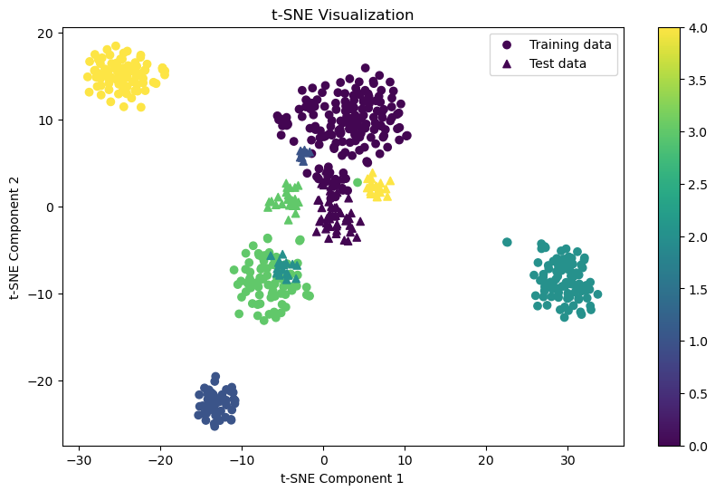

# Team Projects 

# Project #1: Gene Expression Profiles to Identify Cancer Types

## Project Overview

The goal of the Project #1 is to create a simple program with a database to analyze a selected dataset. This project aims to identify different types of cancer using gene expression profiles through regression analysis. Our team designed, implemented, and tested a regression model to predict cancer types based on gene expression data. This project involves data preprocessing, feature selection, model training, evaluation, and visualization of results. We created a program with a database to analyze the data, demonstrating the business impact of our findings.

## Business Value of the Project

The primary business value of this project lies in its potential to significantly improve cancer diagnosis and treatment. By accurately identifying cancer types through gene expression profiles, healthcare providers can:
1. **Enhance Diagnostic Accuracy**: Reduce the chances of misdiagnosis, leading to more effective and personalized treatment plans.
2. **Accelerate Treatment Decisions**: Speed up the diagnosis process, allowing for quicker intervention and potentially better patient outcomes.
3. **Cost Efficiency**: Lower healthcare costs by reducing the need for multiple diagnostic tests and minimizing the trial-and-error approach in treatment plans.
4. **Research and Development**: Provide valuable data and insights that can be used in further research, contributing to the development of new treatments and therapies.

## Team Members

- **Monica L. Rojas-Pena** - monicarojasp@gmail.com
- **Serhiy Zvedenyuk** - skiev31@gmail.com 
- **Iryna Krutiy** - iryna.krutiy@gmail.com 
- **Derek Kam** - derekhkam@yahoo.ca 

## Approach

### Data Collection and Preprocessing

1. **Importing Libraries**
2. **Reading the Data File**
3. **Data Exploration and Cleaning**
4. **Encoding the Labels**
5. **Data Splitting**
6. **Data Normalization**

### Feature Selection and Model Training

1. **Feature Selection**
2. **Classification and Regression**

### Visualization of Results

1. **Scatter Plot of Actual vs. Predicted Values**
2. **Residual Plot**
3. **Distribution of Residuals**
4. **Coefficient Plot**

### Logistic Regression and Evaluation

1. **Testing Logistic Regression**

### Dimensionality Reduction with PCA

1. **Applying PCA**
2. **Linear Regression on PCA Data**
3. **Visualization of PCA Results**

### Dimensionality Reduction with t-SNE

1. **Applying t-SNE**
2. **Visualizing t-SNE Results**

## Team Collaboration and Workflow

### Rules of Engagement

- **Communication**: Regularly update the team through designated channels (Slack, email).
- **Code Reviews**: Each member must review and merge at least one pull request.
- **Documentation**: Thoroughly document all code and processes.
- **Responsibility**: Each member is responsible for their tasks and meeting deadlines.
- **Collaboration**: Provide constructive feedback and support each other.

### Decision Making

- **Project Selection**: We had an initial brainstorming session to come up with multiple project options. Based on the project objective and keeping a strategic view in mind for Part #2 of the project, we selected the one that fits best our interests, is scalable, and can be implemented within the project timeline.
- **Dataset Selection**: As a team, we selected a dataset from open-source repositories.
- **Question Focus**: We focused on identifying the relationship between gene expression profiles and cancer types.
- **Task Assignment**: Tasks were assigned based on individual strengths and interests, ensuring that each team member could contribute effectively.
- **Team Meetings Cadence**: We had regular meetings to ensure alignment between all team members and to keep track of our progress.

### GitHub Workflow

- **Repository Creation**: A new repository was created for the project.
- **Branching Strategy**: Each team member worked on separate branches to avoid conflicts.
- **Pull Requests**: Each team member created, reviewed, and merged at least one pull request.
- **Merge Conflicts**: We learned how to resolve merge conflicts. Helped each other.

## Learnings and Experience

This project, showcased on each team member's GitHub profile, demonstrates our skills, ability to work effectively in a team, and potential to prospective employers. Each team member created a video reflecting on their own learnings and experiences, covering:

- Key takeaways from the project.
- Challenges faced and solutions.
- Insights from the collaborative process.
- Personal growth and skill development.

Links to each team member’s video:

- Monica L. Rojas-Pena: https://drive.google.com/file/d/150xUgFfFxK_SdJutD2TEN8ma-TICMJnl/view?usp=share_link 
- Serhiy Zvedenyuk: https://drive.google.com/drive/folders/1zv_rJXxEj0vgX9c1CDLLmo0uyLZ_NMX2?usp=sharing
- Iryna Krutiy: https://drive.google.com/drive/folders/1v5RKA8ZJRQFYoad1QUJodRQ-aWhKDY_1?usp=sharing 
- Derek Kam: https://drive.google.com/drive/folders/1rYOWh1iXXrADqs5Yo4p1RXnhMowd3Eo2?usp=sharing

## Robustness of Analysis - Quantification

In the first part of our analysis we did not take into account the dimensionality of the data set. Later on we added a dimensionality reduction with PCA and dimensionality reduction with t-SNE.
Based on the results we obtained the accuracy with t-SNE and Logistic Regression of 0.534.

The robustness of the analysis can be quantified by several metrics:

1. **Model Performance**: The model's performance is evaluated using metrics such as Mean Squared Error (MSE) and R-squared (R²) values. For example:
   - **Mean Squared Error**: 0.11 (low value indicates high accuracy)
   - **R-squared**: 0.96 (high value indicates that 96% of the variance in the data is explained by the model)
2. **Cross-Validation**: The model is validated using cross-validation techniques to ensure its reliability and generalizability across different data subsets.
3. **Feature Selection**: Top 200 features are selected based on mutual information scores, ensuring that the most relevant gene expression data is used in the model.

### Logistic Regression Performance

- **Precision, Recall, F1-score**: The logistic regression model showed perfect classification with precision, recall, and F1-scores of 1.00 for all cancer types, indicating highly robust performance on the test data.
- **Confusion Matrix**: The confusion matrix confirmed the perfect classification, showing no misclassifications. 

## Risks, Caveats, Unknowns

1. **Data Quality**: The accuracy of the model depends heavily on the quality and completeness of the gene expression data. Missing or inaccurate data can affect model performance.
2. **Generalizability**: The model may perform well on the training dataset but may not generalize to new, unseen data. This risk can be mitigated through extensive cross-validation and testing on diverse datasets.
3. **Complexity of Cancer**: Cancer is a highly complex and heterogeneous disease. The model may not capture all the nuances and variations in gene expression profiles associated with different cancer types.
4. **Regulatory and Ethical Concerns**: The use of genetic data for diagnosis raises potential regulatory and ethical issues, including patient privacy and consent.
5. **Implementation in Clinical Settings**: Integrating the model into clinical workflows may face challenges such as acceptance by healthcare professionals, need for additional training, and ensuring compatibility with existing systems.
6. **Unknown Variables**: There may be unknown genetic or environmental factors influencing cancer that are not captured by the current model, potentially limiting its accuracy and effectiveness.

In Part #2 of the project, we are planning to continue working on addressing the risks and caveats, and continuing to refine and validate the model to provide valuable insights and practical applications in cancer diagnostics and treatment.

## Conclusion and Recommendations

This project provides insights into using gene expression profiles for cancer type identification and improves skills in machine learning, data analysis, and team collaboration. The primary business value lies in enhancing diagnostic accuracy, accelerating treatment decisions, and reducing healthcare costs. The opportunity for commercialization, research collaboration, and improved patient care highlights the significance of this work.

Pan-cancer RNA-seq analysis is a powerful tool for uncovering molecular insights into cancer biology, differences as well as similarities of the types of cancer, identifying therapeutic targets, and advancing personalized cancer treatment strategies.

This analysis successfully classified 5 different types of cancer gene expression profiles using a machine learning approach. Integrating deep learning into our analysis of cancer gene expression profiles holds great promise for refining classification accuracy and uncovering deeper insights into cancer biology. 

## Appendix

#### Data sources: https://archive.ics.uci.edu/dataset/401/gene+expression+cancer+rna+seq
#### Source code and models: https://github.com/monicarojasp/team_project/tree/team-project-1

